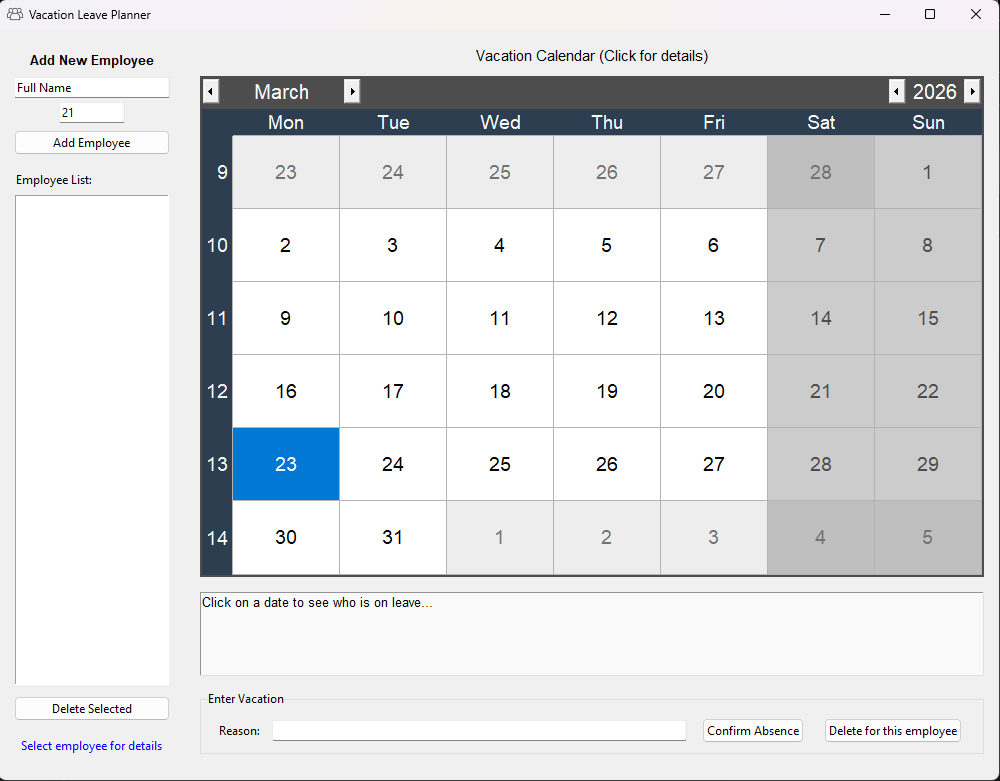
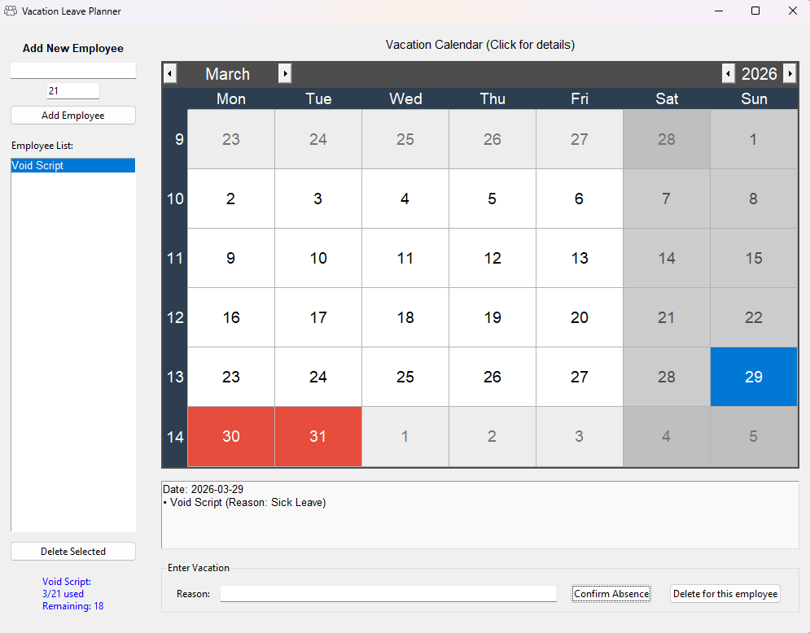

# 📅 Vacation Manager v1.0.0

<div align="center">

**A streamlined desktop tool for managing employee time-off, tracking leave balances, and visualizing schedules.**

[Download Latest Release](https://github.com/TerzicScript/Vacation-Manager/releases) • [Report Bug](https://github.com/TerzicScript/Vacation-Manager/issues) • [Request Feature](https://github.com/TerzicScript/Vacation-Manager/issues)

</div>

## 🎯 Overview

**Vacation Manager** is a lightweight Python application built with Tkinter and SQLite. It provides a centralized way for small teams or HR managers to track annual leave, visualize absences on a calendar, and ensure staffing levels remain consistent.

---

## 📸 Screenshots

| Main Dashboard | Booking a Date |
|:---:|:---:|
|  |  |

---

## ⚙️ How It Works

The application uses a local SQLite database to ensure your data stays private and persistent.

1.  **Data Persistence**: All employee and vacation data is stored in `vacation_records.db`.
2.  **Calendar Integration**: The app uses `tkcalendar` to highlight dates where leave is booked.
3.  **Asset Management**: It looks for `group.ico` to set the window branding.

**Directory Structure:**
```text
Vacation-Manager/
├── main.py
├── group.ico
```

---

### Why This Tool?

- Because tracking vacation days in a messy Excel sheet is a headache you don't need.

---

## ✨ Features

### Core Features

| Feature | Description |
|---------|-------------|
| **Interactive Calendar** | Click any date to see a list of who is on leave and why. |
| **Balance Tracking** | Automatically calculates Used vs. Remaining days for every employee. |
| **Conflict View** | Red highlights on the calendar instantly show "busy" days. |
| **SQLite Backend** | No server setup; data is saved locally in a single database file. |
| **Clean UI** | Minimalist design focusing on ease of entry and quick lookups. |

---

## 💾 Download & Installation

### Option 1: Run from Source

**Requirements:**
- Python 3.8 or higher
- pip package manager

**Installation Steps:**

```bash
# Clone the repository
git clone https://github.com/TerzicScript/Vacation-Manager.git
cd Vacation-Manager

# Install dependencies
pip install tkcalendar

# Run the application
python main.py
```

### Option 2: Pre-Built Executable

1. Go to the [Releases Page](https://github.com/TerzicScript/Vacation-Manager/releases)
2. Download ```VacationManager.exe```
3. Make sure ```group.ico``` is in the same folder if you want the custom icon to appear.
4. Run and enjoy!

---

## 🛠 Building the Executable

To compile this script into a standalone Windows executable, use PyInstaller:

**Requirements:**
- PyInstaller: ```pip install pyinstaller```
- Icon file: ```group.ico``` in the root directory.

**Build Command:**
Run this in your terminal to create a single-file executable:

```bash
pyinstaller --noconsole --onefile --add-data "group.ico;." --icon=group.ico --name="VacationManager" main.py
```

---

## 🚀 Quick Start Guide

### Step 1: Add Employees
Enter the employee's name and their total annual leave allowance (e.g., 21 days), then click **Add Employee**.

### Step 2: Book Vacation
1. Select an employee from the list on the left.
2. Select the date on the calendar.
3. Type a reason (e.g., "Family Trip") and click **Confirm Absence**.

---

## 🙏 Credits

- **Tkinter & SQLite** - For the reliable standard library tools.
- **tkcalendar** - For making calendar widgets actually look good.

---

<div align="center">

[⬆ Back to Top](#-vacation-manager-v100)

</div>
